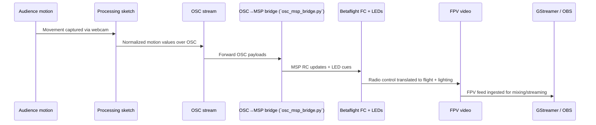

# Perceptual Drift Control Stack Playbook

Welcome to the backstage map for everyone who needs to understand how motion in front of the camera makes the drone dance. This document collects all of the references we stuffed into comments last time and gives them a permanent, merge-friendly home.

---

## High-level flow

1. **People move** in the capture area. A webcam feeds that energy into Processing.
2. The **Processing sketch** distills motion into normalized numbers and ships them over OSC.
3. The **Python OSC→MSP bridge** listens for that OSC firehose, reshapes values into Betaflight-friendly RC microseconds, and writes them over serial to the flight controller.
4. **GStreamer** captures the FPV feed from the drone and lets you color-grade, delay, or otherwise glitch it before you beam it back to the room.

That sequence sketch is the street map—trace any arrow to know which script to poke next. Every stage is intentionally hackable: the architecture is a bunch of small scripts stitched together with human-readable config. Fork any piece, keep the interfaces, and you will not break the show.

---

## Processing gesture tracker

- **Code**: [`software/gesture-tracking/processing/PerceptualDrift_Tracker/PerceptualDrift_Tracker.pde`](../software/gesture-tracking/processing/PerceptualDrift_Tracker/PerceptualDrift_Tracker.pde)
- **Stack**: [Processing](https://processing.org/) with the [processing.video `Capture` API](https://processing.org/reference/libraries/video/Capture.html)
- **OSC plumbing**: [`oscP5`](http://www.sojamo.de/libraries/oscP5/) (built on [`netP5`](http://www.sojamo.de/libraries/netP5/))
- **Core trick**: frame differencing as a cheap motion detector. Watch [Daniel Shiffman's "Optical Flow" lesson](https://www.youtube.com/watch?v=cloJrwaOYYE) for the conceptual primer.
- **Output contract**: the sketch publishes normalized floats on the OSC addresses declared in [`config/mapping.yaml`](../config/mapping.yaml). Latency is effectively frame time, so treat 30 Hz as normal.
- **Customization tips**:
  - Adjust `threshold` for darker or brighter rooms. Lower values see smaller motions but add noise.
  - Rework the centroid logic if you want multi-participant control. If you intentionally port the tracker to C++, there's an archived openFrameworks fork in `software/gesture-tracking/openframeworks`, and the [official examples](https://openframeworks.cc/download/) are killer references so long as you keep the OSC contract identical.
  - If you outgrow Processing, mirror the OSC schema and rebuild in TouchDesigner, Max/MSP, or [cv.jit](https://cycling74.com/products/max) land.

---

## OSC → MSP bridge

- **Code**: [`software/control-bridge/osc_msp_bridge.py`](../software/control-bridge/osc_msp_bridge.py)
- **Protocols**: [Open Sound Control 1.0](http://opensoundcontrol.org/spec-1_0) and Betaflight's [MSP 2.0](https://github.com/betaflight/betaflight.com/blob/master/docs/development/API/MSP-Extensions.md)
- **Python helpers**: [`python-osc`](https://github.com/attwad/python-osc) for OSC, [`pySerial`](https://pyserial.readthedocs.io/en/latest/shortintro.html) for UART access.
- **MSP refresher**: Each packet is `$M<` + payload length + command ID + bytes + XOR checksum. We're only using `MSP_SET_RAW_RC` (ID 200) and pushing eight 16-bit values (roll, pitch, throttle, yaw, AUX1–AUX4).
- **Config**: [`config/mapping.yaml`](../config/mapping.yaml) holds every gain and OSC path. Change that file, not the code.
- **Safety ritual**:
  - Keep a thumb on the physical arming switch. Software consent gates are helpful but not gospel.
  - Point props away from faces. Tape the drone into a test rig while you calibrate curves.
  - Read the [FPV Safety Field Guide](https://www.fpvsafety.org/) before flying around strangers.
- **Debug checklist**:
  - Run the bridge with `--baud 115200 --serial /dev/ttyUSB0` (or whatever port shows up via `ls /dev/ttyUSB*`).
  - Use `socat -x -v` to spy on MSP packets if you suspect framing issues.
  - Betaflight Configurator's Receiver tab is your lie detector—watch the RC bars move as you wiggle in front of the camera.

---

## Mapping YAML

The YAML file is the single source of truth for control curves. It's small, so read it in full. Keys of note:

- `osc.port` and `osc.address_space.*`: which OSC port we bind and which paths the tracker emits.
- `mapping.altitude`, `mapping.lateral`: gain, expo/linear curve, and deadzone tuning knobs. Matching Betaflight's receiver expectations (1100–1900 µs) makes life easy. `expo_strength` (default 0.5) lets you dial how flat the center feels.
- `mapping.yaw_bias`: offsets mechanical drift without touching the flight controller config. `jitter` sprinkles ±noise on the trim so the yaw axis never sticks in a deadband.
- `mapping.leds.palette`: color suggestions for any downstream LED client. The bridge quantizes the OSC `crowd` signal into AUX3 so lighting rigs can chase palette slots.
- `mapping.glitch_intensity`: baseline and ceiling for video FX modules. AUX2 sweeps between those limits as the crowd energy rises.

If you're new to RC curves, skim Oscar Liang's [expo guide](https://oscarliang.com/expo-droneracing/) or play with [EdgeTX curve editors](https://www.edgetx.org/) to understand how gains translate to pilot feel.

---

## Video pipeline

- **Script**: [`software/video-pipeline/gst_launch.sh`](../software/video-pipeline/gst_launch.sh)
- **Engine**: [`gst-launch-1.0`](https://gstreamer.freedesktop.org/documentation/tools/gst-launch.html) plus the stock plugin zoo.
- **Starting point**: `clean_low_latency` preview pipeline. Swap `/dev/video0` if your capture card enumerates differently.
- **Weird mode**: `delayed_glitch` adds a deep queue + `videorate` for VHS smears. Chain in `glitch`, `videobalance`, or [`frei0r` plugins](https://frei0r.dyne.org/) when you want the image to melt.
- **Further study**: The [GStreamer Basic tutorials](https://gstreamer.freedesktop.org/documentation/tutorials/basic/index.html) and [OBS GStreamer source docs](https://obsproject.com/kb/gstreamer-source).

---

## Rapid inspiration dump

- Participatory drone art: [ETH Zürich Spaxels](https://www.dfab.ch/project/spaxels), [Noisebridge Drone Swarm writeups](https://noisebridge.net/wiki/Drone_Swarm)
- Audience-controlled interactive work: [Lauren McCarthy – *US_*](https://lauren-mccarthy.com/US_), [Rafael Lozano-Hemmer – *Pulse Room*](https://www.lozano-hemmer.com/pulse_room.php)
- DIY FPV hacks: [Jeff Thompson FPV performance notes](https://www.jeffreythompson.org/blog/2019/02/24/fpv-drone-performance-notes/)

Print this, tape it to your flight case, and go build something gloriously unhinged.
