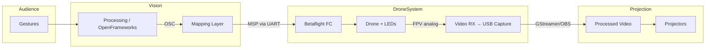

# System Overview (Mermaid)

```mermaid
flowchart LR
    subgraph Audience
        G[Gestures]
    end
    subgraph Vision
        T[Processing / OpenFrameworks]
        G --> T
        T -->|OSC| M[Mapping Layer]
    end
    subgraph DroneSystem
        M -->|MSP via UART| FC[Betaflight FC]
        FC --> D[Drone + LEDs]
        D -->|FPV analog| VRX[Video RX → USB Capture]
    end
    subgraph Projection
        VRX -->|GStreamer/OBS| P[Processed Video]
        P --> Projectors
    end
```
