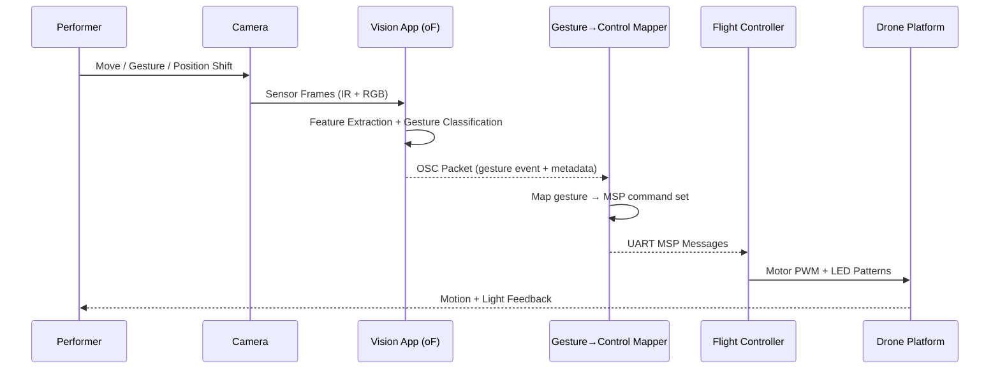

# System Overview (Mermaid)

Welcome to the loud-and-clear map of how Perceptual Drift actually moves, thinks, and glows. This page is meant to be a teaching tool, a living notebook, and a reminder that magic is just a stack of deterministic steps with a bit of synthwave swagger.

## Whole-System Signal Highway

```mermaid
flowchart LR
    subgraph Audience
        G[Gestures &amp; Body Motion]
    end
    subgraph Vision
        CAM[IR / RGB Cameras]
        T[Vision Processing (openFrameworks)]
        G --> CAM --> T
        T -->|OSC| M[Mapping Layer]
    end
    subgraph ControlStack[Drone System]
        M -->|MSP via UART| FC[Betaflight Flight Controller]
        FC --> MOTORS[Drone Motors]
        FC --> LEDCTRL[Addressable LED Driver]
        LEDCTRL --> DLEDs[Onboard LED Array]
        MOTORS --> D[Drone Motion]
        D -->|FPV Analog| VRX[Video RX → USB Capture]
    end
    subgraph Projection
        VRX -->|GStreamer → OBS| P[Processed Video Mix]
        P --> OUTPROJ[Projectors / Displays]
    end
```

The flow above is the bird’s-eye view: humans throw gestures, the vision stack decodes them, the mapping layer translates vibe into control packets, and the drone both flies and beams video back for remixing.

## Stepwise Breakdown: Gesture to Flight



**Teach-back checklist:**

1. Cameras are the first translators, turning vibes into pixels.
2. The openFrameworks vision app crunches those pixels into actionable gesture tags.
3. Mapping code turns gestures into multi-field MSP packets (throttle, roll, LED mode, etc.).
4. Betaflight consumes MSP, applies PID loops, and drives both motors and LEDs.
5. The performer sees light, hears motors, and keeps the feedback loop alive.

## Stepwise Breakdown: Airborne Feedback to Projection


**Notes for operators who like to break rules responsibly:**

* GStreamer is where you shave latency and fix nasty RF artifacts.
* OBS is the playground for overlays, safety warnings, and live annotations.
* If latency spikes, re-check USB capture bandwidth before blaming the drone.

## Ops & Safety Event Ladder


This ladder keeps the crew honest: no jazzing the drone until checklists sing, and every anomaly has a pre-decided escape hatch.

## Remix Ideas & TODOs

* Layer MIDI input on the mapper for hybrid performances.
* Add telemetry overlay (battery, RSSI) in OBS so operators can catch drift early.
* Prototype a “ghost mode” where gestures record to buffer before taking control.

Own the stack, document the weirdness, and keep iterating.
