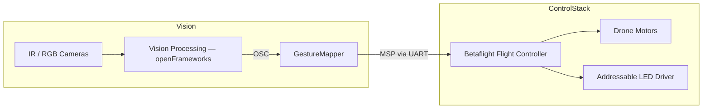
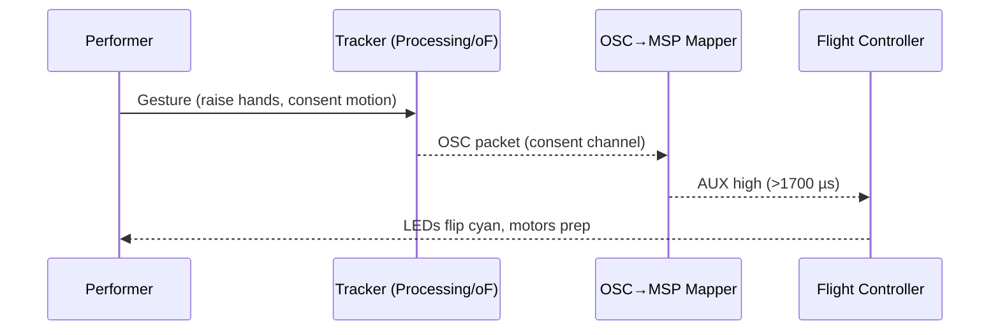
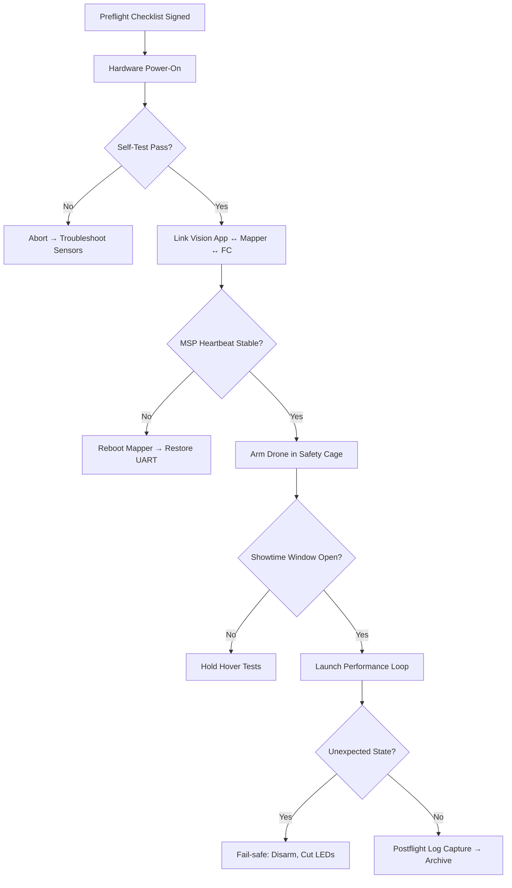

# Perceptual Drift Flight School — Onboarding Playbook

Welcome to the weird, wired, and very human machine we call Perceptual Drift. This playbook shepherds new crew members through three staged levels so you can move from "what is this thing" to "I can run the show" without guessing. Each level links into the deeper manuals — Control Stack, Experience, and Safety — and smuggles in drills you run *now*, not "later when there’s time".

---

## Level 1 — Systems Sighting (read + watch + poke)
**Goal:** Build shared mental models of the full stack and spot the obvious failure modes before they surprise you.

1. **Read:** [Control Stack Playbook](../control-stack-playbook.md) §§ “Signal Path Overview” and “OSC→MSP Bridge.”
2. **Read:** [Experience Playbook](../experience/README.md) § “Journey Map + Parallel Tracks.”
3. **Read:** [Safety Checklist](../checklists/safety_checklist.md) § “Preflight — before anyone is near the net.”
4. **Scan:** [System Diagrams](../diagrams/system-overview.md) so you can narrate the signal flow back without peeking.

**Do this now — Dry-run the bridge.**
```bash
python3 software/control-bridge/osc_msp_bridge.py --serial FAKE --dry-run
```
- Confirm the console prints `[dry-run]` MSP snapshots and note the jitter envelope.
- Sketch in your notebook the first subsystem you would open if microsecond jitter explodes past ±5.

**Quick-reference schematic + watchouts**

- **Camera dropout** → Expect OSC silence; reopen the tracker or swap USB before blaming MSP.
- **Mapper freeze** → Motors hold last known value. Kill power if the stick outputs don’t update for 2 seconds.
- **UART noise** → LEDs may desync before motors do. Treat flicker as an early warning.

✅ **Level 1 sign-off ritual:** Post a screenshot of your dry-run output + your jitter mitigation plan in the crew chat. Tag `#flight-school-lvl1` so leads can rubber-stamp it.

---

## Level 2 — Consent & Choreography (rehearse the human interface)
**Goal:** Practice the gestures, consent toggles, and ritual language until they’re muscle memory.

1. **Revisit:** [Experience Playbook](../experience/README.md) §§ “Roles & Rituals” and “Consent Gate.”
2. **Cross-check:** [Safety Checklist](../checklists/safety_checklist.md) § “Just Before Arming.”
3. **Note:** Control Stack Playbook → “OSC to MSP Bridge” configuration table for AUX channel ranges.

**Do this now — Consent gate rehearsal.**
- Launch `software/gesture-tracking/processing/PerceptualDrift_Tracker/PerceptualDrift_Tracker.pde` in Processing.
- In a quiet space, rehearse the consent AUX toggle sequence: idle amber → briefing → cyan go-live → red abort.
- Log the exact OSC payload values you observe for each stage and compare to `config/mapping.yaml`.

**Quick-reference schematic + watchouts**

- **Gesture misread** → If the consent channel flickers between amber/cyan, lower the motion threshold or reposition the camera.
- **Mapper lag** → ≥300 ms delay between gesture and AUX change means reboot the bridge or kill nonessential apps.
- **Operator script drift** → If anyone improvises the ritual phrasing, pause and re-run the consent call-and-response.

✅ **Level 2 sign-off ritual:** Record a 30-second screen capture of the tracker + OSC console while you narrate the consent ritual. Share it in the crew drive under `onboarding/level-2/` and @ the experience lead.

---

## Level 3 — Safety Loop & Live Fire (simulate a full run)
**Goal:** Chain the full rehearsal end-to-end in a safe sandbox, documenting the bailout paths.

1. **Deep-dive:** [Safety Checklist](../checklists/safety_checklist.md) §§ “Kill-switch drill” and “Contingency Flow.”
2. **Confirm:** Control Stack Playbook → “Failsafe & Throttle Caps” section.
3. **Cross-ref:** [System Diagrams](../diagrams/system-overview.md) → “Ops & Safety Event Ladder.”

**Do this now — Cage-side drill trifecta.**
1. Run the kill-switch drill with the transmitter unplugged from the quad: time the power drop (target <1 s).
2. In a dry cage, power up the quad, run `osc_msp_bridge.py --dry-run` beside Betaflight Configurator, and confirm the `[dry-run]` logs still track your sticks even though the UART stays silent.
3. Perform a ghost run: motors disarmed, but walk through every checklist callout with a partner acting as Safety Second.

**Quick-reference schematic + watchouts**

- **Self-test failure** → Do not skip to link-up; capture logs and notify hardware lead.
- **MSP heartbeat drop** → Flip to manual RC immediately; dry-run logs go to the control-stack repo issue tracker.
- **Unexpected state** → Default to kill-switch + consent gate red. Never re-arm without re-running Section 2 of the checklist.

✅ **Level 3 sign-off ritual:** Submit the filled paper (or digital) safety checklist + run log to `docs/logs/` with today’s date. Ping the safety channel for final approval.

---

## Requesting full sign-off
When all three rituals are logged:
1. Open a new GitHub discussion titled `Onboarding sign-off — <your name>`.
2. Link your Level 1 screenshot, Level 2 video, and Level 3 checklist PDF.
3. Tag `@control-lead`, `@experience-lead`, and `@safety-second`. They’ll review within 48 hours and drop you into the active crew rota.

Keep iterating your notes in the [Assumption Ledger](../ASSUMPTION_LEDGER.md). Punk rock is cool; documented punk rock keeps the drone out of someone’s hair.
