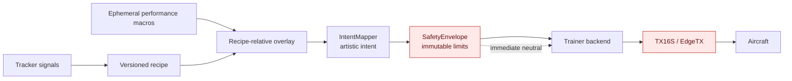
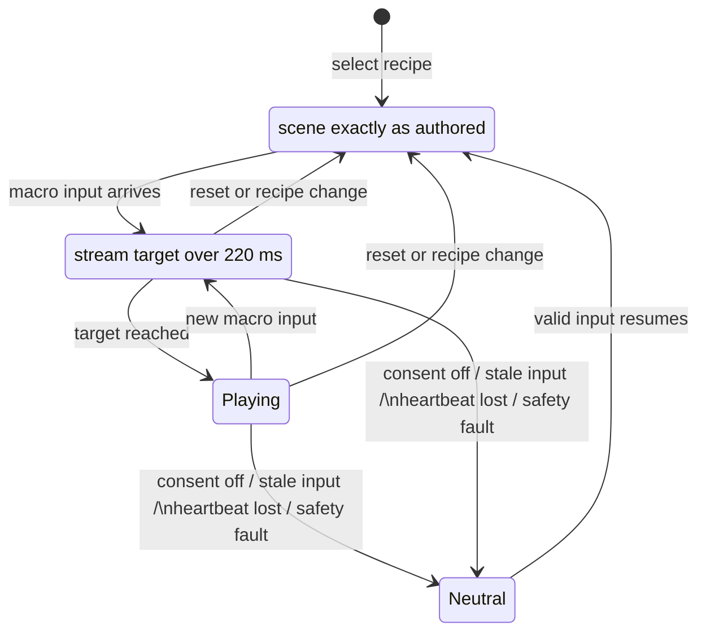
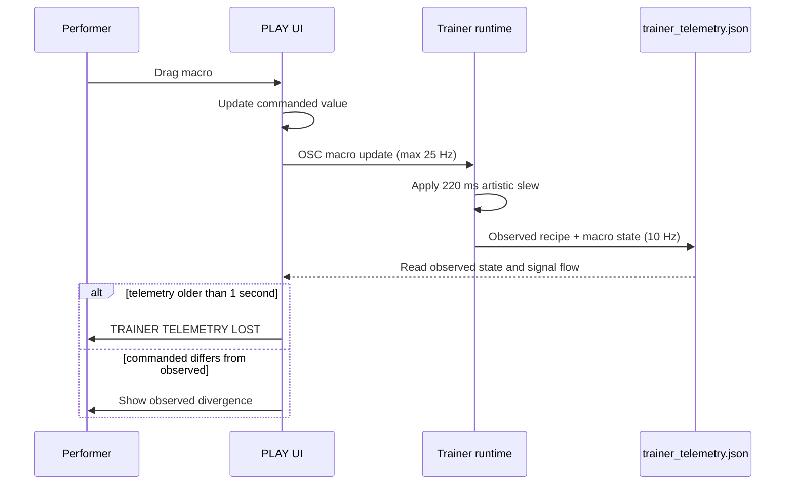
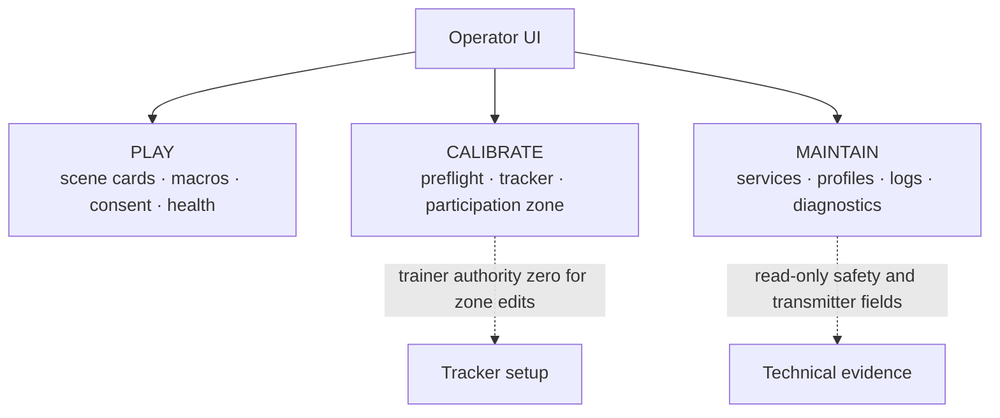

# Performance control

The live control chain is deliberately one-way:

`tracker → recipe → performance overlay → IntentMapper → SafetyEnvelope → trainer backend → TX16S`



The performance overlay is deliberately upstream of the safety boundary. It can
change artistic character, never aircraft or transmitter authority.

Recipes remain version-controlled files. A performance overlay is an in-memory,
per-session layer; it never rewrites a recipe and resets when a scene changes.
`config/performance_macros.yaml` is the only macro vocabulary accepted by the
runtime and UI. It is data-driven and only permits these artistic targets:

| Macro | Targets |
| --- | --- |
| Drift | `mapping.lateral.gain` |
| Touch | `mapping.lateral.deadzone`, `mapping.lateral.curvature` |
| Turn | `mapping.yaw_bias.bias` |
| Nervousness | `mapping.yaw_bias.jitter` |
| Crowd FX | `mapping.glitch_intensity.base` |
| Visual Memory | `mapping.glitch_intensity.max` |

Macros are recipe-relative: centered bipolar controls leave the selected scene
exactly as authored. Drift is a multiplier around the recipe gain; Touch adds
continuous deadzone and curvature around the recipe response (legacy `linear`
and `expo` recipes remain compatible). Macro changes slew over 220 ms by default.
The overlay is bypassed immediately
when consent is off, the operator gate is off, input is stale, bridge heartbeat
is lost, or `SafetyEnvelope` faults. It has no access to aircraft/transmitter
profiles, heartbeat settings, ARM, throttle, flight mode, trainer-enable, ports,
or safety limits.

## Macro lifecycle



Safety neutralization bypasses artistic smoothing; only artistic changes slew.

## PLAY

Run the operator UI as usual, then open `http://127.0.0.1:8088`. PLAY presents
scene cards and the six named macros. It sends validated macro messages to
`/pd/performance/<macro>` and scene selections to `/pd/patch`. Use **Reset scene
feel** to remove every live override and return to recipe behavior. Session
exports include the overlay state and its dispatch history.

To show the input/intent/output teaching trace, start the trainer runtime with:

```sh
pd-trainer-run --serial <bridge-port> --operator-enable \
  --telemetry-file runtime/trainer_telemetry.json
```

The trace displays tracker roll/yaw input, pre-safety artistic intent, and the
safe output. A highlighted safe-output card means the envelope clipped intent.
Trainer telemetry includes observed recipe/macro state and is written at 10 Hz;
PLAY marks it lost after one second rather than showing a stale ACTIVE state.



### Operator views



Only PLAY is intended as the musician-facing instrument surface.

Crowd FX and Visual Memory remain visibly unavailable until a video/lighting
runtime consumes the performance protocol; their UI controls are disabled, not
placebo knobs.

## MIDI and calibration

`config/mappings/performance_midi.yaml` is the forward-looking MIDI binding
format: only `macro:<name>` and `recipe:<name>` targets are valid. The old
`config/mappings/midi.yaml` remains a clearly legacy direct-axis mapping for
compatibility and must not be treated as a PLAY control surface.

`config/tracker_calibration.yaml` starts the nontechnical calibration vocabulary
(Motion sensitivity, Minimum participant/object size, Entry stability, Exit
grace, camera, and zone). It is calibration-only. Participation-zone editing is
reserved for a future camera preview and must occur with trainer authority zero.
